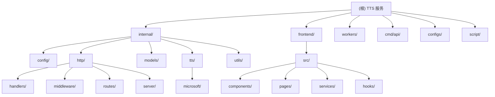

# CLAUDE.md

This file provides guidance to Claude Code (claude.ai/code) when working with code in this repository.

## 变更记录 (Changelog)

- **2025-11-13**: 完成自适应初始化架构分析，生成模块结构图和详细索引
- 原有文档保持不变，新增架构概览和模块索引

## 项目概述

这是一个基于 Microsoft Azure 语音服务的 TTS（Text-to-Speech）服务，提供高质量的语音合成能力。项目包含三个主要部署方式：

1. **Go 服务端**：主要的 HTTP API 服务，提供完整的 TTS 功能和 Web UI
2. **React 前端**：基于 React 19 + TypeScript + Vite 的现代化用户界面
3. **Cloudflare Worker**：轻量级的边缘计算版本，适用于无服务器部署

## 架构总览

### 模块结构图



### 模块索引

| 模块 | 路径 | 语言 | 职责描述 | 关键文件 |
|------|------|------|----------|----------|
| **Go API 服务** | `cmd/api/` | Go | 应用程序入口点，启动和配置管理 | `main.go` |
| **内部业务逻辑** | `internal/` | Go | 核心业务逻辑，TTS 服务，HTTP 处理 | `http/routes/routes.go`, `tts/microsoft/client.go` |
| **配置管理** | `configs/` | YAML | 服务配置，SSML 标签配置，语音映射 | `config.yaml` |
| **React 前端** | `frontend/` | TypeScript | 现代化 Web UI，用户交互界面 | `src/App.tsx`, `src/pages/Home.tsx` |
| **Cloudflare Worker** | `workers/` | JavaScript | 边缘计算版本，无服务器部署 | `src/index.js` |
| **构建脚本** | `script/` | Shell | 构建和部署脚本 | `build.sh` |

## 常用命令

### 本地开发

```shell
# 构建应用程序
go build -o tts ./cmd/api

# 运行应用程序
./tts

# 或使用配置文件运行
./tts -config ./configs/config.yaml

# 运行时指定端口
./tts -port 9000
```

### 测试和构建

```shell
# 注意：当前项目没有 Go 测试文件
# 如需添加测试，请在 internal/ 目录下创建 * _test.go 文件

# 构建二进制文件
go build -o tts ./cmd/api/main.go

# Docker 构建
docker build -t tts .

# 多平台构建（使用脚本）
./script/build.sh
```

### 前端开发

项目前端采用 React 19 + TypeScript 架构，位于 `frontend/` 目录：

```shell
# 进入前端目录
cd frontend

# 安装依赖
npm install

# 启动开发服务器（默认端口 3000）
npm run dev

# 构建生产版本
npm run build

# 预览构建结果
npm run preview

# 代码检查和修复
npm run lint
npm run lint:fix

# TypeScript 类型检查
npm run type-check
```

### Cloudflare Worker 部署

```shell
# 进入 Worker 目录
cd workers

# 安装依赖（首次）
npm install

# 开发模式
npm run dev

# 部署到 Cloudflare
npm run deploy
```

### 依赖管理

```shell
# 下载依赖
go mod download

# 整理依赖
go mod tidy

# 验证依赖
go mod verify
```

## 代码架构

### Go 服务端架构

项目采用标准的 Go 项目结构，遵循分层架构设计：

#### 核心目录结构
- `cmd/api/` - 应用程序入口点
- `internal/` - 私有应用程序代码
  - `config/` - 配置管理（使用 Viper）
  - `http/` - HTTP 层
    - `handlers/` - HTTP 请求处理器
    - `middleware/` - 中间件（CORS、认证、日志）
    - `routes/` - 路由配置
    - `server/` - HTTP 服务器实现
  - `models/` - 数据模型定义
  - `tts/` - TTS 服务层
    - `microsoft/` - Microsoft Azure TTS 客户端实现
  - `utils/` - 工具函数
- `frontend/` - 前端静态资源和模板
  - `src/` - React 源代码
    - `components/` - React 组件
    - `pages/` - 页面组件
    - `services/` - API 服务层
    - `hooks/` - 自定义 Hooks
    - `types/` - TypeScript 类型定义

#### 关键设计模式

1. **接口设计**：`tts.Service` 接口定义了 TTS 服务的核心操作
2. **依赖注入**：通过 `routes.InitializeServices()` 初始化所有服务
3. **配置管理**：使用 `internal/config` 包管理所有配置，支持环境变量覆盖
4. **中间件链**：认证、日志、CORS 等中间件按需组合

#### Microsoft Azure TTS 实现

**核心客户端特性 (`internal/tts/microsoft/client.go`):**
- **动态认证**：JWT 自动刷新机制，提前1分钟过期避免服务中断
- **语音缓存**：语音列表缓存2小时，支持按语言环境过滤
- **SSML 处理**：完整的 SSML 标签支持，智能转义和恢复机制
- **并发控制**：信号量机制控制最大并发请求数（默认20个）
- **分段处理**：大文本自动分割，并发合成后通过 ffmpeg 合并

**SSML 处理机制:**
- 支持所有主要 SSML 标签：`<break>`、`<prosody>`、`<emphasis>`、`<voice>`、`<say-as>`、`<phoneme>`、`<audio>`、`<mstts>` 等
- 占位符机制：先替换特殊标签，HTML 转义，再恢复标签
- 预编译正则表达式提高性能

**认证和签名:**
- MSTranslator Android 应用签名算法
- HMAC-SHA256 签名机制
- JWT 令牌自动管理

### React 前端架构

- **技术栈**：React 19 + TypeScript + Vite + TailwindCSS
- **状态管理**：Zustand 状态管理库
- **HTTP 客户端**：axios，支持请求拦截和错误处理
- **组件化**：基于组件的开发模式，包含 UI 组件库
- **路由**：React Router 处理单页应用路由

### Cloudflare Worker 架构

- 文件位置：`workers/src/index.js`
- 功能：与 Go 版本功能对等的轻量级实现
- 缓存策略：语音列表缓存 4 小时
- SSML 支持：完整的 SSML 标签保留和转义处理
- **部署工具**：Wrangler 4.6.0

## 性能优化特性

### 缓存机制
- **语音列表缓存**：Go: 2小时，Worker: 4小时有效期，减少 Azure API 调用
- **端点认证缓存**：JWT 提前1分钟刷新，保证服务连续性
- **静态资源缓存**：前端资源通过 Go 服务器缓存

### 并发处理
- **分段并发**：大文本自动分割，最多20个并发请求
- **信号量控制**：防止 Azure API 调用过载
- **智能合并**：使用 ffmpeg 高效合并音频片段

### 文本处理优化
- **智能分段**：基于标点符号和长度限制的语义分割
- **SSML 优化**：预编译正则表达式，占位符机制避免重复转义
- **动态调整**：根据配置自动调整分割策略

## API 接口

### 主要端点

- `GET/POST /tts` - 标准 TTS 接口，支持 GET/POST 参数
- `POST /v1/audio/speech` - OpenAI 兼容接口
- `GET /api/v1/tts` - v1 版本 TTS 接口
- `GET /api/v1/voices` - 获取可用语音列表
- `GET /api/v1/config` - 获取服务配置信息
- `GET /api/v1/health` - 健康检查

### 认证机制

- **统一 API Key**：通过 `TTS_API_KEY` 环境变量或配置文件中的 `tts.api_key`
- **多种认证方式**：Bearer Token、Query 参数、请求体参数
- **灵活配置**：支持不同接口使用相同或不同的认证方式

## 重要配置选项

### TTS 配置
- `region`: Azure 语音服务区域
- `segment_threshold`: 文本分段阈值（默认 300）
- `max_concurrent`: 最大并发请求数
- `voice_mapping`: OpenAI 语音到 Azure 语音的映射

### SSML 处理
- 支持完整的 SSML 标签保留
- 可配置的标签模式匹配
- 自动 HTML 转义和标签恢复

### 前端配置
- `VITE_API_BASE_URL`: API 基础 URL
- `VITE_APP_TITLE`: 应用标题
- 开发/生产环境自动配置

## 开发注意事项

### 核心特性
1. **语音缓存**：Microsoft TTS 客户端实现了语音列表缓存，避免频繁 API 调用
2. **并发控制**：支持最大并发限制，防止 API 调用过载
3. **错误处理**：统一的错误处理和日志记录
4. **优雅关闭**：支持信号处理和优雅关闭
5. **静态文件服务**：前端资源通过 Go 服务器提供服务
6. **类型安全**：前端使用 TypeScript 提供类型安全

### 特殊处理机制
1. **文本分段**：超过 `segment_threshold`（默认300字符）的文本会自动分割处理
2. **SSML 保留**：完整保留 SSML 标签，支持复杂的语音合成需求
3. **OpenAI 兼容**：提供 OpenAI API 兼容接口，支持第三方应用集成
4. **音频格式**：支持多种音频输出格式，默认为 MP3

### 环境配置
1. **时区设置**：Docker 容器默认时区为 `Asia/Shanghai`
2. **代理支持**：Go 构建使用 `goproxy.cn` 代理
3. **健康检查**：提供 `/api/v1/health` 健康检查端点

## 环境变量优先级

环境变量 > 配置文件 > 默认值

常用环境变量：
- `SERVER_PORT` - 服务端口
- `TTS_API_KEY` - TTS API 密钥
- `OPENAI_API_KEY` - OpenAI API 密钥（实际使用 TTS_API_KEY）
- `TTS_REGION` - Azure 区域
- `VITE_API_BASE_URL` - 前端 API 基础 URL

## AI 使用指引

### 代码生成建议
1. **Go 代码**：遵循 `internal/` 包结构，保持依赖注入模式
2. **前端组件**：使用 TypeScript，遵循现有组件命名规范
3. **配置变更**：优先使用环境变量，避免硬编码配置
4. **错误处理**：使用统一的错误处理模式，记录详细日志

### 调试技巧
1. **日志查看**：使用日志级别控制调试信息
2. **API 测试**：使用 `/api/v1/health` 检查服务状态
3. **缓存检查**：注意语音列表缓存可能影响调试
4. **前端调试**：使用浏览器开发者工具查看网络请求

### 性能优化方向
1. **缓存策略**：合理设置语音列表缓存时间
2. **并发控制**：根据 Azure API 限制调整并发数
3. **文本分段**：优化文本分段算法，提高合成质量
4. **前端优化**：使用 React 最佳实践，优化组件渲染性能